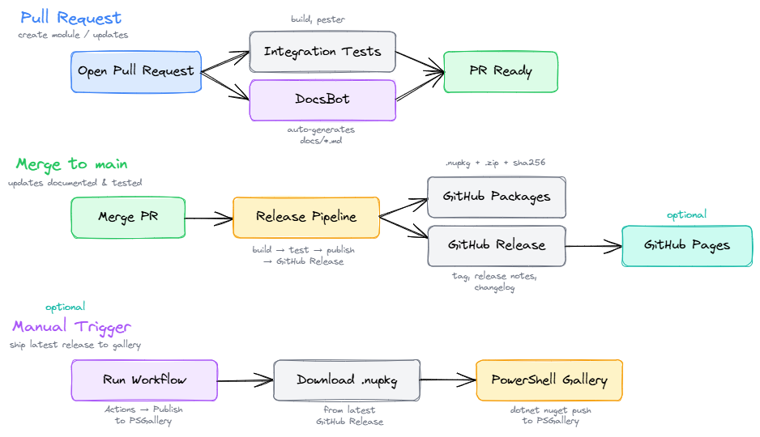

# PSModuleTemplate

A template repository for creating PowerShell modules with built-in CI/CD, testing, and best practices.

## About

PSModuleTemplate provides a standardized structure for developing PowerShell modules with automated testing, building, and deployment workflows.
Use this template to quickly bootstrap new PowerShell module projects with industry-standard tooling and practices.

## Pipeline Architecture

The CI/CD pipeline is split across three workflows triggered at different stages.



**Pull request** — opening a PR triggers two parallel jobs: integration tests (build + Pester) and the DocsBot which auto-generates markdown documentation for exported commands. Both must pass before the PR is ready to merge.

**Merge to main** — merging triggers the release pipeline which builds, tests, publishes to GitHub Packages, and creates a GitHub Release with the `.nupkg`, `.zip`, sha256 hashes, and auto-generated release notes. If GitHub Pages is enabled, the site is rebuilt automatically.

**Manual publish** — the PSGallery workflow is triggered manually from the Actions tab. It downloads the `.nupkg` from the latest GitHub Release and pushes it to the PowerShell Gallery.

## Features

- Pre-configured module structure
- Easy building and testing with make
- Pester testing framework integration
- Dependency management with PSDepend
- GitHub Actions CI/CD workflows
- C# class support
- Enum support with automatic loading
- Argument completer support
- Automatic documentation
- Optional GitHub Pages site generation

## Getting Started

### Prerequisites

- [Git](https://git-scm.com/install)
- [Make](https://gnuwin32.sourceforge.net/packages/make.htm)
- [PowerShell Core](https://learn.microsoft.com/en-us/powershell/scripting/install/install-powershell-on-windows)

### Using This Template

Click the '[Use this template](https://github.com/jdarcyryan/PSModuleTemplate/generate)' button at the top of this repository to create a new repository based on this template.

### Quick Start
```bash
# Clone your new repository
git clone https://github.com/OWNER/MODULE_NAME.git
cd MODULE_NAME

# Set up the module structure
make setup
```

## Usage

### Setting up your module

This creates a folder with the repository name, housing the module files/folders.
```bash
make setup
```

### Installing dependencies

This installs any required modules defined in `PSDepend.psd1` at the root of your repository.
If no `PSDepend.psd1` file exists, this step is skipped gracefully.
```bash
make depend
```

### Perform a build

This builds a nupkg from your source code into the .output folder.
```bash
make build
```

### Running tests

This runs all pester tests against the built module.
```bash
make pester
```

## Module Structure

The module loads in this order: **classes → enums → private → public → completers**.

### Classes

Defined in `classes/` and loaded in the order specified in `classes/classes.psd1`. Order matters — parent classes must be listed before children. Supports `.ps1`, `.cs`, and `.dll` files.

### Enums

Defined in `enums/` as `.ps1` files and loaded automatically.

```powershell
# enums/LogLevel.ps1
enum LogLevel {
    Debug
    Info
    Warning
    Error
    Critical
}
```

### Private Functions

Defined in `private/`, one function per file. Available within the module but not exported.

### Public Functions

Defined in `public/`, one function per file, using the `Verb-Noun` convention. To export these functions, they must be included in the `FunctionsToExport` array inside the module manifest.

### Argument Completers

Defined in `completers/` and loaded last. Provide tab-completion for function parameters. Use an underscore naming convention (e.g. `Complete_ParameterName.ps1`) — they are excluded from Pester naming and help tests.

```powershell
# completers/Complete_LogLevel.ps1
Register-ArgumentCompleter -CommandName 'Write-Log' -ParameterName 'Level' -ScriptBlock {
    param($commandName, $parameterName, $wordToComplete, $commandAst, $fakeBoundParameters)

    [LogLevel].GetEnumNames() | where { $_ -like "$wordToComplete*" } | foreach {
        [System.Management.Automation.CompletionResult]::new($_, $_, 'ParameterValue', $_)
    }
}
```

## Dependencies

Module dependencies are managed using [PSDepend](https://github.com/RamblingCookieMonster/PSDepend).
To declare dependencies, create or edit the `PSDepend.psd1` file in the root of your repository.

A simple example that installs the latest version of a module from PSGallery:
```powershell
@{
    'Microsoft.PowerShell.ConsoleGuiTools' = 'latest'
}
```

You can also pin versions, use hashtable format for more control, or pull from Git repositories.
See the comments in the included `PSDepend.psd1` template for all supported options.

Any modules listed in `PSDepend.psd1` should also be added to `RequiredModules` in your module manifest so that PowerShell enforces the dependency at import time.

## Custom Scripts

For advanced scenarios that fall outside the standard module build process, two custom scripts are available.
These are intended for things like compiling native or foreign-language code, staging external binaries, or configuring specialised environments.

### Container Setup

`.build/scripts/Invoke-ContainerSetup.ps1`

Runs during environment or container initialisation. Use this for installing SDKs, runtimes, configuring environment variables, authenticating with external feeds, or validating toolchain versions before any build steps execute.

### Post Build

`.build/scripts/Invoke-PostBuild.ps1`

Runs after the module has been built to the output directory but before the nupkg is packed. Use this for copying compiled DLLs or native binaries into the output module folder, embedding additional metadata, signing output binaries, or staging any extra assets that need to be included in the final package.

## Pipelines

### Pull Request

On pull request, the module will be built and tested with the pester tests in your repository.
Another runner will execute, producing markdown documentation for exported functions.

### Merge to master

Once you merge your pull request, this will carry out the same steps but also release your package.
It will produce release notes, changelog and a nupkg in GitHub packages.

__Note__: _this will fail if the version is not bumped, or if the current version already exists as a release or package._

### Publish to PSGallery

A manually triggered workflow is available to publish your module to the [PowerShell Gallery](https://www.powershellgallery.com/).
This workflow downloads the `.nupkg` from the latest GitHub release and pushes it to PSGallery.

To use this workflow:

1. Ensure a GitHub release exists with a `.nupkg` asset (created automatically by the merge to master pipeline).
2. Add a `PSGALLERY_API_KEY` secret to your repository or organisation. You can generate an API key from your [PSGallery account](https://www.powershellgallery.com/account).
3. Navigate to the **Actions** tab, select the **Publish to PSGallery** workflow, and click **Run workflow**.

### After merge

After merging to master, markdown files for each public function in the module will be created.
Ensure Get-Help is accurate and populated, as this will be referenced to create the documentation.

## GitHub Pages

This template includes a workflow that can automatically generate a documentation site for your module using GitHub Pages. The site is built from your repository's markdown files and includes your README as the homepage, exported command documentation, releases fetched from the GitHub API, and any LICENSE, CONTRIBUTING, or CODE_OF_CONDUCT files.

### Enabling GitHub Pages

1. Go to **Settings** → **Pages** in your repository.
2. Under **Build and deployment**, set the source to **GitHub Actions**.
3. Push to `main` or manually trigger the workflow from the **Actions** tab.

The site will be published at `https://<owner>.github.io/<repo>/`.

### What gets included

The Pages workflow only publishes markdown files (`.md`), license files (`LICENSE`, `LICENSE.txt`), and image assets from the `assets/` folder. Everything else in your repository (source code, build scripts, tests, etc.) is excluded.

### Favicon

To add a favicon to your site, place an SVG file at `assets/favicon.svg` in your repository.

### How it works

The workflow dynamically generates the site at build time — no Jekyll configuration files need to be committed to your repository. It detects which community files exist (LICENSE, CONTRIBUTING, CODE_OF_CONDUCT) and conditionally adds them to the navigation. If GitHub Pages is not enabled, the workflow skips gracefully without failing.

## Contributing

We welcome contributions! Please see [CONTRIBUTING](CONTRIBUTING.md) for details on how to contribute to this project.

## License

This project is licensed under the Apache 2.0 License - see the [LICENSE](LICENSE) file for details.

Copyright (c) 2026 James D'Arcy Ryan

## Author

**James D'Arcy Ryan**

- GitHub: [@jdarcyryan](https://github.com/jdarcyryan)

## Acknowledgments

Thank you to all contributors who help improve this template!